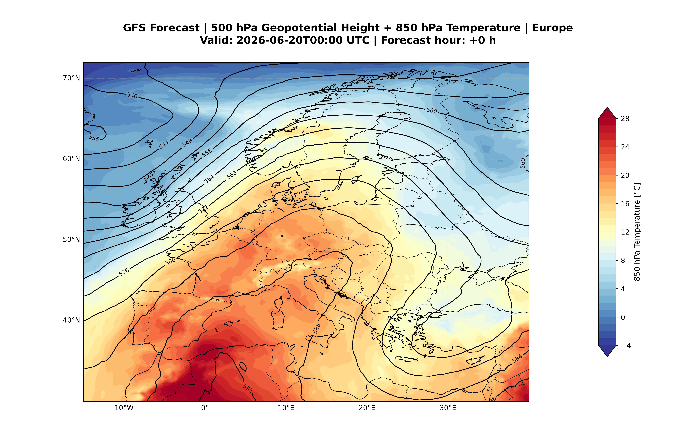

# Synoptics

Automated synoptic analysis and AI-assisted meteorological briefing generation from numerical weather prediction (NWP) model data.

The project combines atmospheric diagnostics, oceanic background conditions, teleconnection indices, and large language models to produce professional synoptic weather briefings, forecast maps, animations, and PDF reports.

---

## Overview

Synoptics automatically:

- Downloads and processes GFS forecast data
- Generates synoptic forecast maps
- Detects large-scale atmospheric features
- Evaluates oceanic and teleconnection background conditions
- Produces AI-generated meteorological assessments
- Exports professional PDF briefing reports
- Creates forecast animations

---

## Example Output

### 500 hPa Geopotential Height + 850 hPa Temperature



### Forecast Evolution


---

## Main Components

### Atmospheric Diagnostics

- 500 hPa geopotential height
- Sea-level pressure
- 850 hPa temperature
- Jet stream analysis
- Precipitable water (PWAT)
- CAPE/CIN diagnostics
- Fronts and synoptic-scale structures

### Ocean and Climate Background

#### NOAA OISST v2.1

- Global daily sea-surface temperature analysis
- Mediterranean SST anomaly
- North Atlantic SST anomaly

#### Teleconnection Indices

- North Atlantic Oscillation (NAO)
- East Atlantic Pattern (EA)

---

## Workflow

```text
GFS Forecast Data
        ↓
Map Generation
        ↓
Feature Detection
        ↓
Ocean Diagnostics
        ↓
Teleconnection Diagnostics
        ↓
AI Synoptic Assessment
        ↓
PDF Briefing Report
```

---

## Outputs

- Synoptic maps (PNG)
- Forecast animations (GIF)
- AI-generated PDF briefings
- Climate diagnostics (JSON)

---

## Usage

```bash
python src/run_all.py \
  --fxx-list "0,6,12,24,48,72,96,120,144,168,192,216,240"
```
